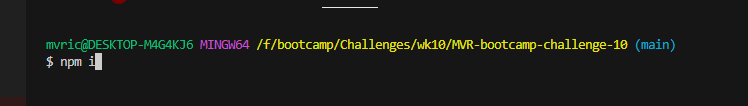
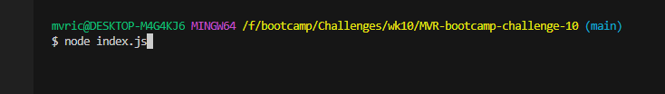
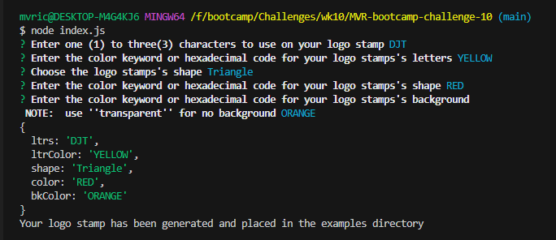

# MVR-bootcamp-challenge-10

## Object-oriented Programming Challenge: SVG Logo Maker
This repository is used to to create simple Scalable Vector Graphics (SVG) logo for use on projects without hiring an expensive graphic designer.

## Usage
Upon downloading the repository the user opens it up in their integrated terminal and install the required modules through *"npm i"* command.  
 
After installing the necessary modules, the user can then open the node program in the integrated terminal and run the logo maker by using the *"node index.js"* command. 
 
The user is then prompted with a series of questions that will request information used to build the SVG file image that can be found in the examples directory for use. 
 

[Demo Video](https://drive.google.com/file/d/1WC8LWPueuGw2dMxYG0wmQY43zbPE9ckg/view)

## Contributors
Consulting and guidance used in creation of this repository include peers and resources (in no order) as follows:
* Lindsey Isaac
* Matt Montiel
* Brian Hamlin
* Daniel Cohen

## License
[MIT License](./LICENSE)
